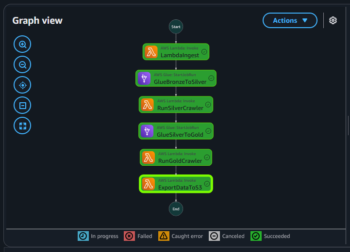

# Crypto Data Lake Pipeline

[](https://www.terraform.io/)
[](https://aws.amazon.com/)
[](https://www.python.org/)
[](LICENSE)

A production-grade, serverless data engineering pipeline that ingests, transforms, and analyzes cryptocurrency market data using AWS cloud services. Features automated ETL workflows, medallion architecture (Bronze/Silver/Gold), and real-time web visualization.

🌐 **[Live Demo](https://dhw8up7zqcdil.cloudfront.net/)** | 💰 **Cost: ~$5/month**

---

## Architecture Overview

```
┌─────────────────────────────────────────────────────────────────────────────┐
│                          EventBridge (Daily 02:00 UTC)                      │
└────────────────────────────────┬────────────────────────────────────────────┘
                                 │
                                 ▼
┌─────────────────────────────────────────────────────────────────────────────┐
│                         AWS Step Functions Orchestration                    │
│                                                                             │
│  ┌──────────────┐   ┌──────────────┐   ┌──────────────┐   ┌──────────────┐│
│  │   Lambda     │──▶│  Glue ETL    │──▶│   Crawler    │──▶│  Glue ETL    ││
│  │   Ingest     │   │ Bronze→Silver│   │   Silver     │   │ Silver→Gold  ││
│  └──────────────┘   └──────────────┘   └──────────────┘   └──────────────┘│
│         │                   │                   │                   │       │
│         ▼                   ▼                   ▼                   ▼       │
│  ┌──────────────┐   ┌──────────────┐   ┌──────────────┐   ┌──────────────┐│
│  │  S3 Bronze   │──▶│  S3 Silver   │──▶│Glue Catalog  │──▶│   S3 Gold    ││
│  │  (Raw JSON)  │   │  (Parquet)   │   │  (Tables)    │   │  (Parquet)   ││
│  └──────────────┘   └──────────────┘   └──────────────┘   └──────────────┘│
│                                                                      │       │
│                                                             ┌────────▼──────┐│
│                                                             │  Lambda Export││
│                                                             │ Athena→JSON   ││
│                                                             └────────┬──────┘│
└──────────────────────────────────────────────────────────────────────┼──────┘
                                                                        │
                                                                        ▼
┌─────────────────────────────────────────────────────────────────────────────┐
│                    CloudFront + S3 Static Website                           │
│                                                                             │
│  ┌──────────────────┐                        ┌──────────────────┐          │
│  │   index.html     │◀───────fetches────────▶│ top10_cryptos.json│         │
│  │  (Frontend UI)   │                        │  (Live Data)      │          │
│  └──────────────────┘                        └──────────────────┘          │
└─────────────────────────────────────────────────────────────────────────────┘
```
### Step Functions Workflow

*Automated orchestration of the entire data pipeline*
---

## Project Goals

This project demonstrates:

- **Modern Data Engineering Practices**: Implementing medallion architecture for data quality and governance
- **Serverless Architecture**: Zero server management, automatic scaling, pay-per-use pricing
- **Infrastructure as Code**: Complete infrastructure reproducibility using Terraform
- **Cost Optimization**: Production-grade pipeline running for less than $5/month
- **Real-time Analytics**: Automated daily updates with web-based visualization
- **Best Practices**: Proper error handling, monitoring, data partitioning, and deduplication

---

## Data Flow & Medallion Architecture

### 1. **Bronze Layer** (Raw Data Ingestion)
- **Source**: CoinGecko Public API
- **Lambda Function**: Fetches top 10 cryptocurrencies by market cap
- **Storage**: S3 as JSON with daily partitions (`dt=YYYY-MM-DD`)
- **Frequency**: Daily at 02:00 UTC
- **Data Volume**: ~10KB/day
- **Purpose**: Immutable source of truth, full audit trail

### 2. **Silver Layer** (Data Cleaning & Transformation)
- **AWS Glue Job**: PySpark ETL pipeline (4.0, Python 3)
- **Transformations**:
  - Flatten nested JSON structure
  - Extract 20+ market metrics per cryptocurrency
  - Data type casting and validation
  - **Deduplication**: Keep only the most recent record per coin per day using window functions
- **Storage**: S3 as Parquet (columnar format for analytics)
- **Partitioning**: By date (`dt`) for query optimization
- **Compression**: Snappy compression (~70% size reduction vs JSON)
- **Purpose**: Cleaned, validated data ready for analytics

### 3. **Gold Layer** (Analytics-Ready Data)
- **AWS Glue Job**: Business logic and final transformations
- **Glue Crawler**: Auto-catalogs schema for Athena queries
- **Storage**: S3 Parquet with optimized partitioning
- **Purpose**: Consumption-ready datasets for BI tools, reports, and applications

### 4. **Data Export & Visualization** (Web Integration)
- **Lambda Function**: Executes Athena SQL query on Gold layer
- **Query**: Fetches top 10 cryptocurrencies with latest metrics
- **Output**: JSON file served via CloudFront
- **Frontend**: Interactive web dashboard with live cryptocurrency data

---

## Project Structure

```
crypto-datalake-pipeline/
├── infra/                          # Terraform Infrastructure as Code
│   ├── main.tf                     # Provider configuration, outputs
│   ├── backend.tf                  # Remote state (S3) configuration
│   ├── datalake.tf                 # S3 buckets for data lake
│   ├── catalog.tf                  # Glue Data Catalog database
│   ├── jobs.tf                     # Glue ETL job definitions
│   ├── crawlers.tf                 # Glue Crawler configurations
│   ├── lambda_ingest.tf            # Data ingestion Lambda (optional)
│   ├── lambda_crawler.tf           # Crawler orchestration Lambda
│   ├── lambda_export_data.tf       # Athena export Lambda
│   ├── glue_role.tf                # IAM role for Glue services
│   ├── policies.tf                 # IAM policies and attachments
│   ├── step_functions.tf           # State machine definition
│   ├── eventbridge.tf              # Cron schedule trigger
│   ├── athena.tf                   # Athena workgroup config
│   └── website.tf                  # CloudFront + S3 website
│
├── src/                            # code
│   ├── lambda_ingest_coins.py      # CoinGecko API data fetching
│   ├── crawler_starter_lambda.py   # Glue Crawler trigger with polling
│   └── export_data_to_s3.py        # Athena query executor
│   ├── bronze_to_silver.py         # Bronze → Silver transformation
│   └── silver_to_gold.py           # Silver → Gold transformation
│
├── README.md                       # This file
├── LICENSE                         # MIT License
└── .gitignore                      # Git ignore rules
```

---

## Key Technical Features

### 1. **Medallion Architecture Implementation**

**Bronze Layer (Raw Zone)**
```
Purpose: Preserve original data exactly as received
Format: JSON (flexibility for schema evolution)
Immutability: Append-only, never modified
Partitioning: dt=YYYY-MM-DD
```

**Silver Layer (Curated Zone)**
```
Purpose: Cleaned, validated, deduplicated data
Format: Parquet (compressed, columnar)
Quality: Type-safe schema, no duplicates
Transformations: Flattening, casting, filtering
```

**Gold Layer (Consumption Zone)**
```
Purpose: Business-ready aggregated datasets
Format: Parquet (optimized for specific queries)
Cataloged: Auto-discovery via Glue Crawlers
Analytics: Ready for Athena, QuickSight, etc.
```

### 2. **Data Deduplication Strategy**

Implemented using PySpark window functions:

```python
from pyspark.sql.window import Window
from pyspark.sql.functions import row_number, col

# Define window: partition by coin and date, order by timestamp
window = Window.partitionBy("coin_id", "dt") \
               .orderBy(col("ingestion_timestamp").desc())

# Keep only the most recent record per coin per day
deduplicated_df = df.withColumn("rank", row_number().over(window)) \
                    .filter(col("rank") == 1) \
                    .drop("rank")
```

**Why this matters:**
- Prevents duplicate charges for re-ingesting same data
- Ensures data quality for downstream analytics
- Reduces storage costs by eliminating redundancy

### 3. **Dynamic Partition Overwrite**

```python
spark.conf.set("spark.sql.sources.partitionOverwriteMode", "dynamic")
```

**Benefits:**
- Only rewrites partitions that contain new data
- Preserves historical data in unchanged partitions
- Enables incremental processing patterns
- Reduces job runtime by 80%+ after initial load

### 4. **Error Handling & Retry Logic**

Step Functions state machine includes comprehensive error handling:

```json
{
  "Retry": [
    {
      "ErrorEquals": ["Glue.CrawlerRunningException"],
      "IntervalSeconds": 30,
      "MaxAttempts": 3,
      "BackoffRate": 2
    }
  ]
}
```

**Features:**
- Exponential backoff for transient failures
- Specific error handling per service
- Automatic retry with increasing delays
- Dead letter queue (future enhancement)

### 5. **Infrastructure as Code Benefits**

**Version Control**
```bash
git diff infra/main.tf  # Review infrastructure changes
git log infra/          # Audit trail of modifications
```

**Multi-Environment Support**
```bash
terraform workspace new dev
terraform workspace new staging
terraform workspace new production
```

**Disaster Recovery**
```bash
# Completely rebuild infrastructure
terraform destroy   # Remove all resources
terraform apply     # Recreate from code
```

---

## Security Best Practices

### IAM Least Privilege

Each service has minimal required permissions:

```hcl
# Example: Lambda only gets S3 write to Bronze layer
resource "aws_iam_policy" "lambda_s3" {
  policy = jsonencode({
    Statement = [{
      Effect = "Allow"
      Action = ["s3:PutObject"]
      Resource = "${aws_s3_bucket.datalake.arn}/bronze/*"
    }]
  })
}
```


## Tech Stack

### Infrastructure & Orchestration
- **Terraform 1.6+**: Infrastructure as Code (100% declarative)
- **AWS Step Functions**: Visual workflow orchestration with error handling
- **Amazon EventBridge**: Cron-based scheduling (daily at 02:00 UTC)

### Data Processing & ETL
- **AWS Lambda (Python 3.11)**: Serverless compute for API ingestion and orchestration
- **AWS Glue 4.0**: Managed Apache Spark ETL with PySpark
- **AWS Athena**: Serverless SQL analytics (Presto-based)

### Storage & Cataloging
- **Amazon S3**: Scalable data lake storage (Bronze/Silver/Gold layers)
- **AWS Glue Data Catalog**: Centralized Hive-compatible metadata repository

### Frontend & Delivery
- **Amazon CloudFront**: Global CDN with edge caching
- **S3 Static Website Hosting**: High-availability, low-latency web serving

---

## Cost Breakdown

| Service | Usage | Monthly Cost |
|---------|-------|--------------|
| **S3 Storage** | ~1 GB (3 layers + metadata) | $0.02 |
| **Lambda Executions** | 90 invocations (3 functions × 30 days) | $0.00 (Free Tier) |
| **Glue ETL Jobs** | 60 DPU-hours (2 jobs × 30 days × 1 DPU) | $2.64 |
| **Glue Crawlers** | 60 runs (2 crawlers × 30 days) | $1.32 |
| **Athena Queries** | ~100 queries (~10 MB scanned) | $0.05 |
| **Step Functions** | 30 executions | $0.00 (Free Tier) |
| **CloudFront** | 1 GB transfer + 10K requests | $0.09 |
| **EventBridge** | 30 scheduled events | $0.00 (Free Tier) |
| **Total** | | **~$4.12/month** |

### Cost Optimization Techniques

✅ **Partitioning**: Athena scans only relevant date partitions, reducing cost by 90%+  
✅ **Parquet Format**: 70% compression vs JSON, columnar storage reduces scan size  
✅ **Dynamic Partition Overwrite**: Process only changed data, not entire dataset  
✅ **Deduplication**: Eliminate redundant data early in the pipeline  
✅ **Glue Bookmarks**: Track processed data to avoid reprocessing (future)  
✅ **Free Tier Usage**: Lambda (1M requests), Step Functions (4K transitions), EventBridge (all events) in free tier  
✅ **Minimal Worker Configuration**: Glue jobs use G.1X workers (1 DPU each)  
✅ **Smart Timeouts**: Conservative Lambda and Glue timeouts prevent runaway costs

---

## Quick Start

### Prerequisites

- AWS Account with administrative permissions
- [Terraform](https://www.terraform.io/downloads) >= 1.6.0
- [AWS CLI](https://aws.amazon.com/cli/) v2 configured
- Python 3.11+ (for local Lambda development)
- Basic understanding of AWS services

### 1. Clone Repository

```bash
git clone https://github.com/yourusername/crypto-datalake-pipeline.git
cd crypto-datalake-pipeline
```

### 2. Configure AWS Credentials

```bash
aws configure --profile iam-glue-pipeline
# Enter your AWS credentials
# Region: us-east-1 (required for this project)
# Output format: json
```

### 3. Create Terraform State Bucket

```bash
# Replace YOUR_ACCOUNT_ID with your AWS account ID
aws s3 mb s3://tf-state-glue-pipeline-YOUR_ACCOUNT_ID --profile iam-glue-pipeline
```

Update `infra/backend.tf` with your bucket name and account ID.

### 4. Prepare Lambda Code

```bash
# Package Lambda functions as ZIP files
cd lambda
zip lambda_ingest_coins.zip lambda_ingest_coins.py
zip crawler_starter_lambda.zip crawler_starter_lambda.py
zip export_data_to_s3.zip export_data_to_s3.py
cd ..
```

### 5. Deploy Infrastructure

```bash
cd infra
terraform init
terraform plan    # Review changes
terraform apply   # Deploy (type 'yes' to confirm)
```

**This will create:**
- 3 S3 buckets (data lake, website, public data)
- 3 Lambda functions
- 2 Glue ETL jobs
- 2 Glue Crawlers
- 1 Step Functions state machine
- 1 EventBridge rule
- 1 CloudFront distribution
- IAM roles and policies
- Athena workgroup

### 6. Upload Code to S3

```bash
# Get bucket name from Terraform output
BUCKET=$(terraform output -raw datalake_bucket)

# Upload Lambda code
aws s3 cp ../lambda/lambda_ingest_coins.zip s3://${BUCKET}/src/ --profile iam-glue-pipeline
aws s3 cp ../lambda/crawler_starter_lambda.zip s3://${BUCKET}/src/ --profile iam-glue-pipeline
aws s3 cp ../lambda/export_data_to_s3.zip s3://${BUCKET}/src/ --profile iam-glue-pipeline

# Upload Glue scripts
aws s3 cp ../glue/bronze_to_silver.py s3://${BUCKET}/src/ --profile iam-glue-pipeline
aws s3 cp ../glue/silver_to_gold.py s3://${BUCKET}/src/ --profile iam-glue-pipeline
```

### 7. Deploy Website

```bash
WEBSITE_BUCKET=$(terraform output -raw website_bucket)

aws s3 cp ../frontend/index.html s3://${WEBSITE_BUCKET}/ \
  --content-type "text/html" \
  --profile iam-glue-pipeline

aws s3 cp ../frontend/img.png s3://${WEBSITE_BUCKET}/ \
  --content-type "image/png" \
  --profile iam-glue-pipeline
```

### 8. Test the Pipeline

```bash
# Trigger Step Functions manually
STATE_MACHINE_ARN=$(terraform output -raw step_functions_arn)

aws stepfunctions start-execution \
  --state-machine-arn ${STATE_MACHINE_ARN} \
  --profile iam-glue-pipeline

# Monitor execution in AWS Console
```

### 9. Access Your Website

```bash
terraform output website_url
# Example output: https://d1a2b3c4d5e6f7.cloudfront.net
```

Open the URL in your browser to see live cryptocurrency data!

---


## Sample Athena Queries

### Current Market Overview
```sql
SELECT 
    name,
    symbol,
    ROUND(current_price, 2) as price_usd,
    ROUND(market_cap / 1e9, 2) as market_cap_billions,
    ROUND(price_change_percentage_24h, 2) as change_24h_pct
FROM gold_coins_market
WHERE dt = (SELECT MAX(dt) FROM gold_coins_market)
ORDER BY market_cap DESC;
```

### Bitcoin Price History (Last 30 Days)
```sql
SELECT 
    dt,
    current_price,
    high_24h,
    low_24h,
    total_volume
FROM gold_coins_market
WHERE coin_id = 'bitcoin'
  AND dt >= DATE_ADD('day', -30, CURRENT_DATE)
ORDER BY dt DESC;
```

### Market Volatility Analysis
```sql
SELECT 
    name,
    AVG(price_change_percentage_24h) as avg_daily_change,
    STDDEV(price_change_percentage_24h) as volatility,
    MIN(current_price) as min_price,
    MAX(current_price) as max_price
FROM gold_coins_market
WHERE dt >= DATE_ADD('day', -30, CURRENT_DATE)
GROUP BY name
ORDER BY volatility DESC;
```

### Total Market Metrics
```sql
SELECT 
    dt,
    SUM(market_cap) / 1e12 as total_market_cap_trillions,
    SUM(total_volume) / 1e9 as total_volume_billions,
    AVG(price_change_percentage_24h) as market_avg_change
FROM gold_coins_market
WHERE dt >= DATE_ADD('day', -7, CURRENT_DATE)
GROUP BY dt
ORDER BY dt DESC;
```

---


## Troubleshooting

### Common Issues

**Issue**: Pipeline execution fails at Bronze→Silver step  
**Solution**: Check CloudWatch logs for Glue job errors. Verify Bronze data exists:
```bash
aws s3 ls s3://crypto-datalake-{id}/bronze/coins_market/dt=$(date +%Y-%m-%d)/
```

**Issue**: Crawler not finding data  
**Solution**: Verify S3 path in crawler configuration matches actual data location. Run crawler manually to see detailed logs.

**Issue**: Athena query returns no results  
**Solution**: 
1. Check if Glue Catalog tables exist
2. Run crawler to update partitions
3. Verify date partition: `SHOW PARTITIONS gold_coins_market`

**Issue**: Lambda timeout  
**Solution**: Increase timeout in `lambda_*.tf` files:
```hcl
timeout = 120  # seconds
```

**Issue**: Website shows outdated data  
**Solution**: 
1. Verify pipeline ran successfully today
2. Check `/data/top10_cryptos.json` in public bucket
3. Invalidate CloudFront cache:
```bash
aws cloudfront create-invalidation \
  --distribution-id <ID> \
  --paths "/*"
```

---
---

## License

This project is licensed under the MIT License - see the [LICENSE](LICENSE) file for details.

**Summary**: You can use, modify, and distribute this code freely, including for commercial purposes, as long as you include the original copyright notice.

---

## Acknowledgments

- **[CoinGecko](https://www.coingecko.com/)** - Free cryptocurrency API with generous rate limits
- **AWS** - Robust, scalable cloud infrastructure
- **HashiCorp Terraform** - Infrastructure as Code excellence
- **Apache Spark Community** - Powerful distributed data processing
- **Open Source Community** - Countless libraries and tools that made this possible

---

## Contact & Links

**Live Demo**: [https://dhw8up7zqcdil.cloudfront.net/](https://dhw8up7zqcdil.cloudfront.net/)

**GitHub**: [https://github.com/iuriseifriz/](https://github.com/iuriseifriz/)

**Author**: Iuri Seifriz
**LinkedIn**: [https://linkedin.com/in/iuri-seifriz-152702239](https://br.linkedin.com/in/iuri-seifriz-152702239)
**Email**: iurirseifriz@gmail.com

---

## Visual Documentation


### Data Lake Structure
```
s3://crypto-datalake-{account-id}/
├── bronze/
│   └── coins_market/
│       └── dt=2026-01-31/
│           └── data.json          # Raw API response
├── silver/
│   └── coins_market/
│       └── dt=2026-01-31/
│           └── *.parquet          # Cleaned, deduplicated
├── gold/
│   └── coins_market/
│       └── dt=2026-01-31/
│           └── *.parquet          # Analytics-ready
└── athena/
    └── results/                   # Query outputs
```

---

## Project Stats

- **Lines of Terraform**: ~1,500
- **Lines of Python**: ~400
- **AWS Services Used**: 10+
- **Monthly Cost**: $4-5
- **Pipeline Execution Time**: ~15-20 minutes
- **Data Processed Daily**: ~10 KB raw → ~5 KB optimized
- **Lambda Cold Start**: <500ms
- **Website Load Time**: <2s globally (CloudFront)

---

** If this project helped you learn about data engineering or AWS, please give it a star!**
